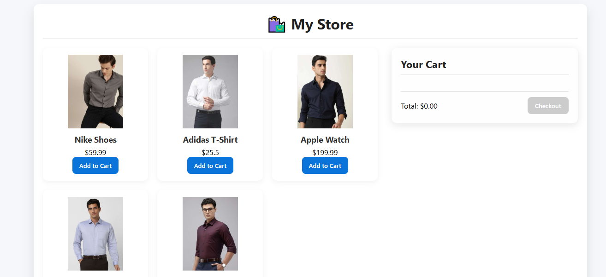

# 🛒 E-Commerce Product List + Cart

A sleek and functional **E-Commerce frontend** built using **HTML, CSS, and JavaScript**.  
Add products to your cart, view real-time total, and simulate a shopping experience — all without backend.

---

## 📸 Preview

  

---

## 🔥 Features

- 🧾 **Dynamic Product List** (loaded from JS array)
- 🛒 **Add to Cart** with quantity updates
- 📦 **Real-Time Total Calculation**
- 🧹 Clean, Responsive UI
- 🔄 Easily Extendable with LocalStorage or API

---

## 📁 Folder Structure
```
ecommerce-cart/
├── index.html
├── style.css
├── app.js
```

---

## ⚙️ DOM Targets

| Element                 | Selector         |
|-------------------------|------------------|
| Product container       | `#product-list`  |
| Cart items container    | `#cart-items`    |
| Add to Cart buttons     | `.add-to-cart`   |
| Total price display     | `#total`         |
| Checkout button         | `#checkout-btn`  |

---

## 🧠 Logic Flow

### 🔹 1. Load Products
- Products stored in an array
- Loop and render as cards in `#product-list`

### 🔹 2. Add to Cart
- If product exists → increment quantity
- Else → add new product to cart array

### 🔹 3. Render Cart
- Display items with name × qty and total
- Update total price dynamically

---

 