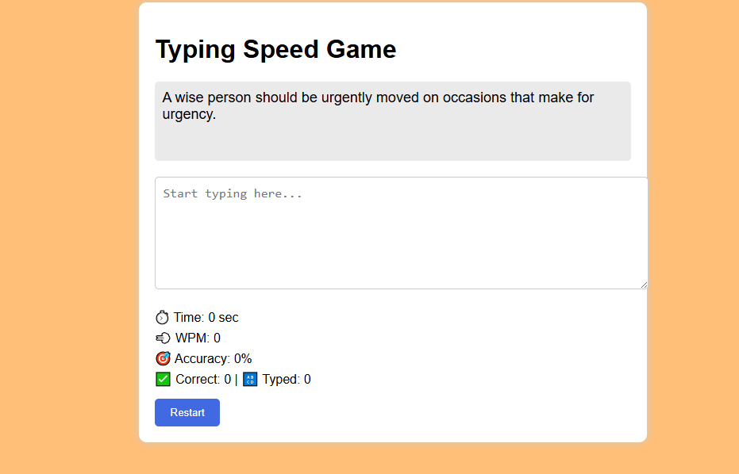

# Typing Speed Game

A simple web-based typing speed test app that fetches random quotes and measures your typing speed (WPM) and accuracy live.

---

## Demo

Open `index.html` in a modern browser. No backend or build steps needed.

---

## Features

- Fetches random quotes from a public API
- Displays quote as individual characters to type
- Live timer starts on first keypress
- Highlights correct and incorrect characters
- Shows real-time Words Per Minute (WPM) and accuracy
- Plays typing sound on every key input
- Restart button to load a new quote and reset stats
- Input disables once quote is fully typed

---

## Usage

1. Open `index.html`
2. Start typing the displayed quote
3. Watch timer, WPM, and accuracy update live
4. When done, input box disables automatically
5. Click **Restart** to try another quote

---

## File Structure

- `index.html` — markup and UI
- `typing.css` — styling
- `app.js` — game logic and API calls
- `type.mp3` — typing sound effect (optional)

---

## Notes

- Requires internet connection for quotes API
- Typing sound may be blocked on some browsers until first interaction
- Tested on Chrome, Firefox

---

## Screenshots

---

## Author

**_Rahul Sah_** 💖💕 gulabi dill

---

Feel free to fork, star ⭐, and contribute!
